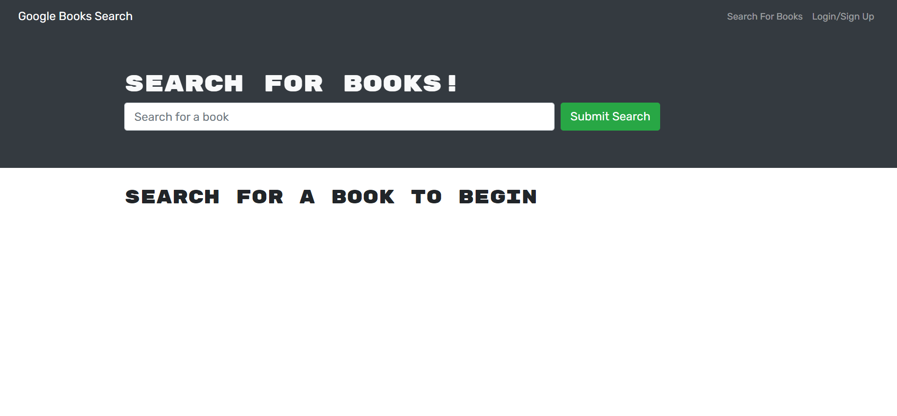

# gQL_BookSearch

## Table of Contents

-[Project Description](#description)

-[Installation](#installation)

-[Usage](#usage)

-[License](#license)

-[Links](#links)

-[Tests](#tests)

-[Contributions](#contributions)

## Description

This is a booksearch app refactored from MERN to gQL.

## Installation

npm i

## Usage

You can sign up for an account, search books, add a book to your saved books, and view and delete your saved books.

## License

N/A

## Links

Link to application: https://merngqlbooksearch.herokuapp.com/

Image of running application

## Tests

N/A

## Contributions

N/A

## Contact

For additional information, contact me at my github:
www.github.com/GarrettA01 or email me at gman.anderson2001@gmail.com!
